# NBA Quiz Game

NBA Quiz Game refers to a short test of knowledge, with 20 questions in length with multiple choice. This Quiz has no commercial intention.

[Link to my code via Github pages](https://github.com/JoaoHigino/NbaQuizGame)

[Link to my Application deployed by Heroku](https://nbaquizgame.herokuapp.com)

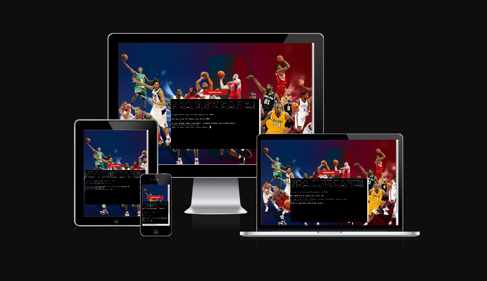

## How To Play

First, you will need to enter your name to start the game. 

Then the quiz will start, it is a multiple choice game (A,B,C,D).

There are 20 questions and you get 5% for right answers and 0 for wrong. If you answer all the 20 questions correctely you get 100%.

The restart button is always available to reset the game and start over.

At the end of each game, you will be asked if you want to play again.

## Features

### Existing Features

- Restart Game Button

  - This button allows the player to reset the game.
  
 

- Username

 

- Quiz

  - The beginning menu will introduce you to the game and ask you to write your username.

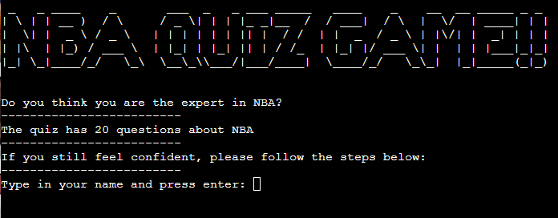

  - When the game starts a question will appear and the player needs to choose an option between A, B, C, D.

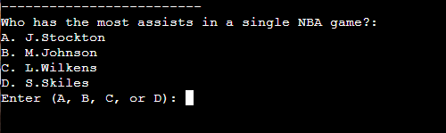

  - All 20 questions are different with different options to choose from.

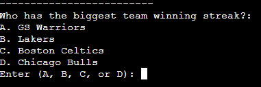

  - When the player answers correctly a CORRECT! will show on the top of the screen.

  - When the player answers incorrectly a WRONG! will show on the top of the screen.

  - When the player tries to answer a different option outside the valid ones(A, B, C, D) an error message will show up and asks the player to try again.

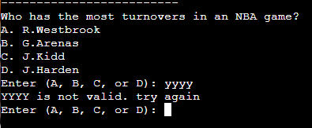

  - When the game concludes the results are presented with all the player answers and the correct answers, which will give a score out of 20 and a total %.

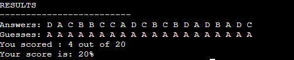

  - After the final result a message asks if the player wants to play again, if the answer is "yes" the game will restart and if the answer is "no" a BYE message shows and the program ends.

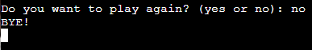

## Features Left to Implement

- Create a scoreborad to compile all time results. 

## Technologies Used

- [HTML5](https://en.wikipedia.org/wiki/HTML5)
- [CSS3](https://en.wikipedia.org/wiki/Cascading_Style_Sheets)
- [JavaScript](https://en.wikipedia.org/wiki/JavaScript)
- [Wikipedia](https://en.wikipedia.org/wiki/Concentration_(card_game))- was used to check the memory game rules
- [Gitpod](https://www.gitpod.io) - was used to create the website
- [Github](https://github.com) - was used to store repository of website and deploy the website
- [Chrome Dev Tools](https://developer.chrome.com/docs/devtools) - was used to view and experiment with styles
- [Google Fonts](https://fonts.google.com) - was used to find the fonts for the website
- [Pexels](https://www.pexels.com) - provided the images seen throughout the website
- [Grammarly](https://app.grammarly.com) - was used to check typography.
- [Am I Responsive](https://ui.dev/amiresponsive?url=https://joaohigino.github.io/CHANGE/) - was used to produce the website mockup.
- [JSHint](https://jshint.com/) - was used to find errors in Javascript code

## Testing

### Browser testing

 - Chrome

 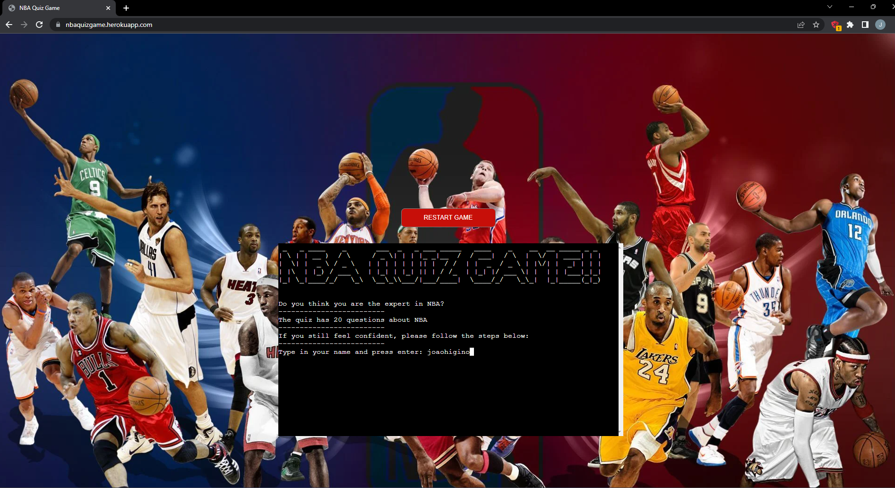

 - Opera

 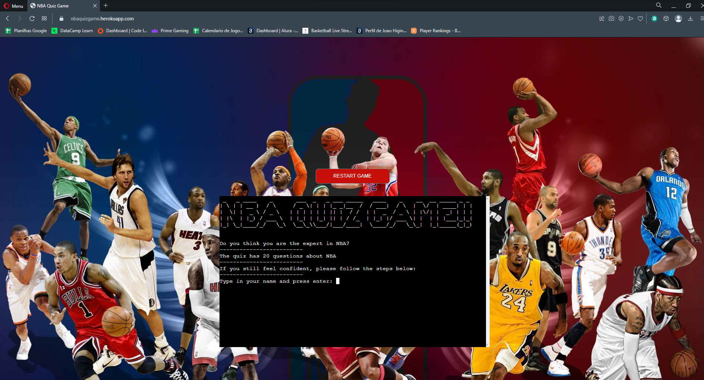

 - Edge

 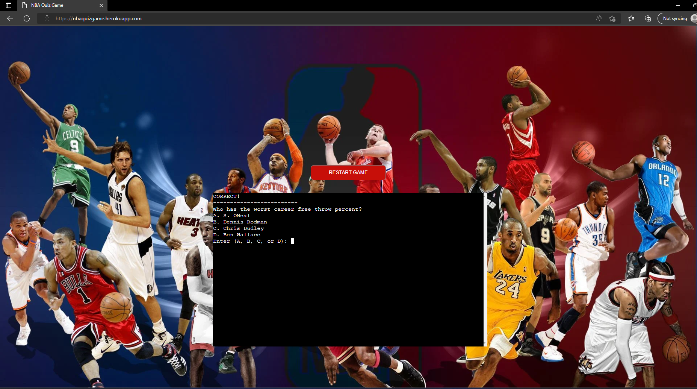

 - Safari

 

### Validator Testing 

  - Built into Code Institute template. Add-ons allow for error checking.
  - Pep8 website down for testing.

### Unfixed Bugs

  - I am aware when you press control+c the game stops, it was a helpfull feature used during testing.

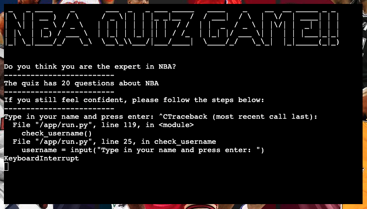

## Deployment!!!!!!!!!!!!!!!!

### Local Deployment!!!!!!!!!!

## Credits

### Media

 - [Background Image](https://wallpaperaccess.com/full/103106.jpg)

### Sources

- [Interactive Quiz Game](https://www.makeuseof.com/python-make-interactive-quiz-game/)

- [Hangman](https://github.com/Kaylaesmith1/python-hangman/blob/main/views/layout.html)

- [Python Tutorial - Multiple Choice Quiz](https://www.youtube.com/watch?v=myJ36xIR7Yg)

- [How to Generate Multiple Choice Questions with Python](https://pythonprogramming.altervista.org/how-to-generate-multiple-choice-questions-with-python/?doing_wp_cron=1665429912.8629679679870605468750)

- [Football Quiz](https://github.com/mikyrenato/3rd_Project_Quiz_Game)

- [Most Embarassing NBA Records](https://basketballforever.com/2020/06/12/the-most-embarrassing-nba-records-of-all-time-2)

- [Most Umbreakable Records NBA History](https://www.nbcsports.com/chicago/bulls/10-most-unbreakable-records-nba-history)

- [NBA Stats](https://www.nba.com/stats)

- [Basketball Reference](https://www.basketball-reference.com/)

### Acknowledgements

- To my amazing wife Sandra, my best friend, my mentor, and my safe haven, without her, all my dreams will be impossible to achieve. She is everything.
- To my two kids, Maria and Thomas, with them life is easy and light. They make me laugh and think that our future is bright. 
- To my family and friends - for being a great support and providing a lot of the user testing for me, especially my friends from "Liga 7 BP" with their craziness helped me to clean my head.
- To my mentor Tim Nelson for all his guidance, support, tips, and feedback.
- The Code Institute community on slack and my classmates its been a pleasure so far.